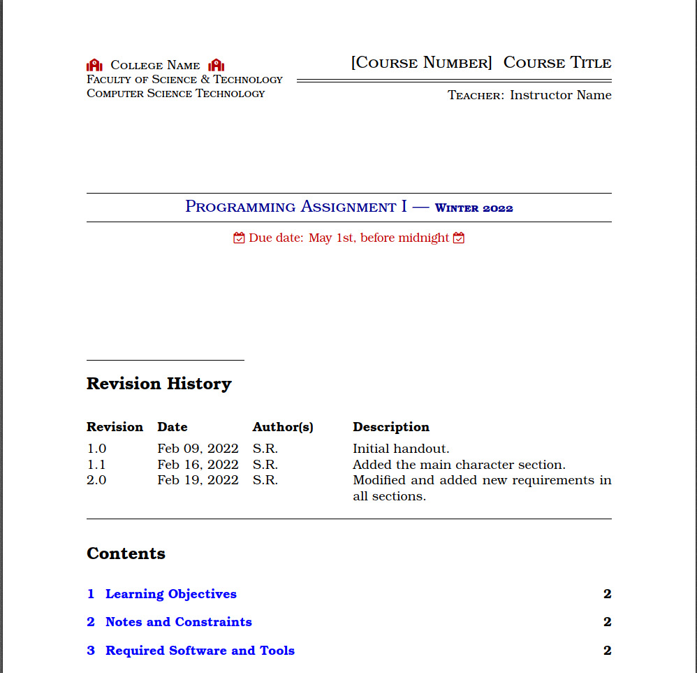
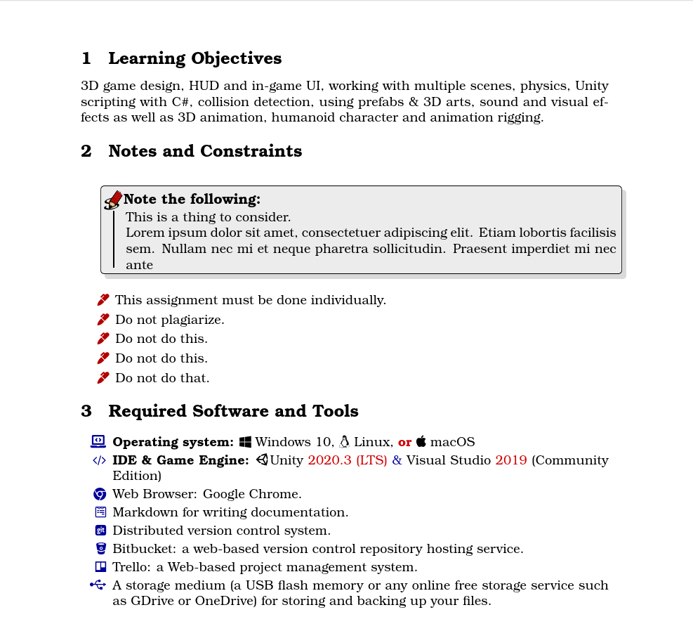

# latex-homework
This is a template for writing assignments/homework. It is suitable for computer science university/college students and features a modular design, fontawesome, dingbat lists, and a grading scheme table.

## Main Features

- Modular structure.

- Dingbat lists.

- Fontawesome.

- Cover page.

- Note box.

- Hyperlinked table of content.

- Metadata injected in the produced PDF document.

- Grading scheme table.

  ​
  ​

## Working Examples

* [Assignment example](examples/Assignment-Example.pdf)

